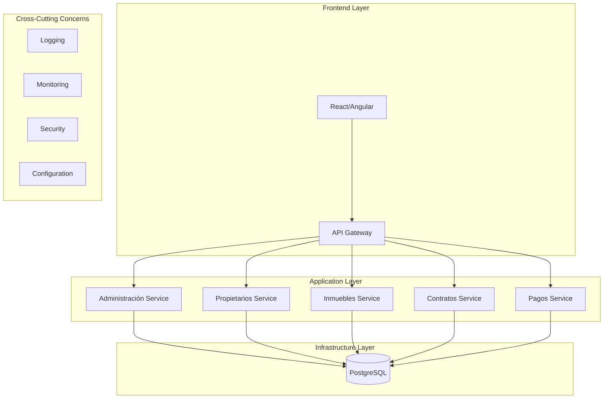
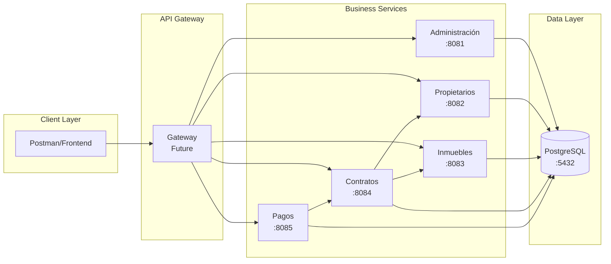
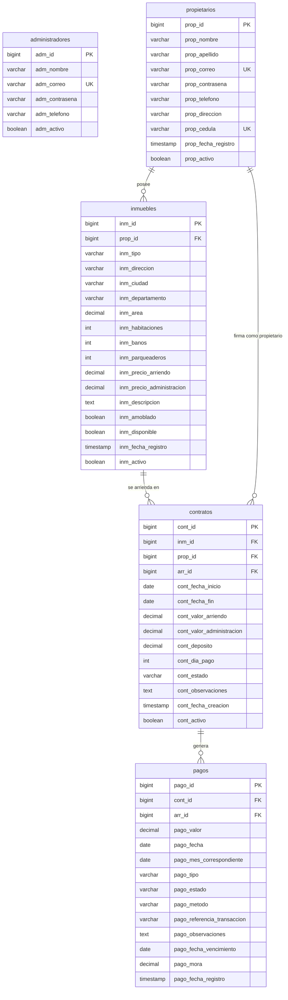
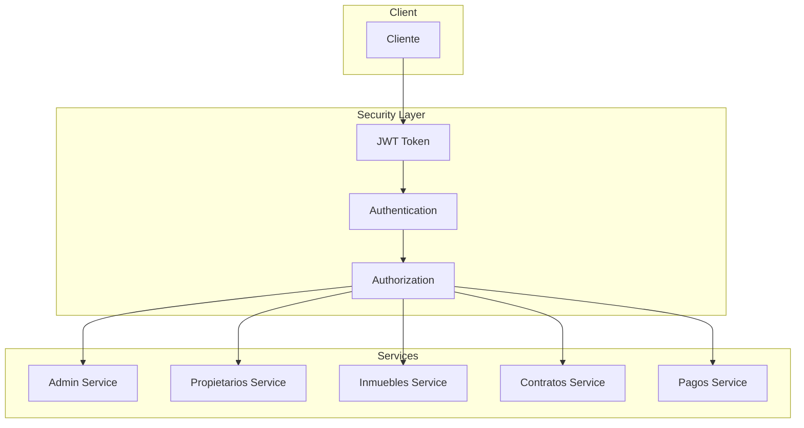

# 🏛️ Guía de Arquitectura

Esta documentación describe la arquitectura del sistema de gestión de arrendamientos, patrones de diseño implementados y decisiones técnicas.

## 📋 Índice

- [🎯 Visión General](#-visión-general)
- [🏗️ Arquitectura de Microservicios](#️-arquitectura-de-microservicios)
- [💾 Arquitectura de Datos](#-arquitectura-de-datos)
- [🔄 Patrones de Diseño](#-patrones-de-diseño)
- [🔗 Comunicación Entre Servicios](#-comunicación-entre-servicios)
- [🛡️ Seguridad](#️-seguridad)
- [📈 Escalabilidad](#-escalabilidad)

---

## 🎯 Visión General

### Principios Arquitectónicos

El sistema está diseñado siguiendo estos principios fundamentales:

1. **Single Responsibility**: Cada microservicio tiene una responsabilidad específica
2. **Loose Coupling**: Servicios independientes con mínimas dependencias
3. **High Cohesion**: Funcionalidades relacionadas agrupadas lógicamente
4. **Database per Service**: Cada servicio gestiona sus propios datos
5. **API First**: Interfaces bien definidas antes de la implementación

### Stack Tecnológico



---

## 🏗️ Arquitectura de Microservicios

### Diagrama de Componentes



### Responsabilidades por Servicio

| Servicio | Responsabilidades | Dependencias |
|----------|-------------------|--------------|
| **Administración** | • Autenticación JWT<br/>• Gestión de administradores<br/>• Autorización | Ninguna |
| **Propietarios** | • CRUD de propietarios<br/>• Validación de datos<br/>• Encriptación de contraseñas | Ninguna |
| **Inmuebles** | • Catálogo de propiedades<br/>• Búsquedas y filtros<br/>• Gestión de disponibilidad | Ninguna |
| **Contratos** | • Contratos de arrendamiento<br/>• Validaciones de negocio<br/>• Estados del contrato | Propietarios, Inmuebles |
| **Pagos** | • Registro de pagos<br/>• Historial financiero<br/>• Estados de pagos | Contratos |

### Beneficios de la Arquitectura

#### ✅ Ventajas

- **Escalabilidad Independiente**: Cada servicio puede escalar según demanda
- **Tecnología Heterogénea**: Diferentes tecnologías por servicio si es necesario
- **Despliegue Independiente**: Actualizaciones sin afectar otros servicios
- **Tolerancia a Fallos**: Fallo de un servicio no afecta a otros
- **Equipos Independientes**: Desarrollo paralelo por equipos especializados

#### ⚠️ Desafíos

- **Complejidad de Comunicación**: Manejo de llamadas entre servicios
- **Consistencia de Datos**: Transacciones distribuidas
- **Monitoreo**: Trazabilidad a través de múltiples servicios
- **Testing**: Pruebas de integración más complejas

---

## 💾 Arquitectura de Datos

### Modelo de Base de Datos



### Principio "Database per Service"

Cada microservicio es propietario de sus datos:

```yaml
Administración Service:
  - Tabla: administradores
  - Acceso: Directo
  
Propietarios Service:
  - Tabla: propietarios
  - Acceso: Directo
  
Inmuebles Service:
  - Tabla: inmuebles
  - Acceso: Directo
  - Referencias: prop_id (validado via API)
  
Contratos Service:
  - Tabla: contratos
  - Acceso: Directo
  - Referencias: inm_id, prop_id (validadas via API)
  
Pagos Service:
  - Tabla: pagos
  - Acceso: Directo
  - Referencias: cont_id (validado via API)
```

### Estrategias de Consistencia

#### 1. **Eventual Consistency**
- Actualizaciones asíncronas entre servicios
- Tolerancia a inconsistencias temporales

#### 2. **Saga Pattern** (Futuro)
- Transacciones distribuidas
- Compensación automática en caso de fallo

#### 3. **Event Sourcing** (Roadmap)
- Registro de eventos para auditoria
- Reconstrucción del estado desde eventos

---

## 🔄 Patrones de Diseño

### 1. Repository Pattern

Cada servicio implementa el patrón Repository para abstracción de datos:

```java
@Repository
public interface PropietarioRepository extends JpaRepository<Propietario, Long> {
    Optional<Propietario> findByCorreo(String correo);
    boolean existsByCorreo(String correo);
}
```

### 2. Service Layer Pattern

Capa de servicio para lógica de negocio:

```java
@Service
public class PropietarioService {
    @Autowired
    private PropietarioRepository repository;
    
    public PropietarioResponse registrar(PropietarioRequest request) {
        // Lógica de negocio
        // Validaciones
        // Transformaciones
    }
}
```

### 3. DTO Pattern

Separación entre modelos de datos y APIs:

```java
// Entidad de datos
@Entity
public class Propietario { /* ... */ }

// DTO para requests
public class PropietarioRequest { /* ... */ }

// DTO para responses  
public class PropietarioResponse { /* ... */ }
```

### 4. Circuit Breaker (Futuro)

Para tolerancia a fallos en comunicación entre servicios:

```java
@Component
public class PropietarioClient {
    @CircuitBreaker(name = "propietarios")
    @Retry(name = "propietarios")
    public Optional<Propietario> findById(Long id) {
        // Llamada HTTP
    }
}
```

### 5. Gateway Pattern (Futuro)

API Gateway para enrutamiento y cross-cutting concerns:

```yaml
spring:
  cloud:
    gateway:
      routes:
        - id: propietarios
          uri: lb://propietarios-service
          predicates:
            - Path=/api/propietarios/**
```

---

## 🔗 Comunicación Entre Servicios

### Tipos de Comunicación

#### 1. **Síncrona - HTTP REST**

Usado actualmente para validaciones:

```java
// En Contratos Service
@Service
public class ContratoService {
    
    @Autowired
    private WebClient.Builder webClientBuilder;
    
    private Boolean validarPropietarioExiste(Long propietarioId) {
        return webClientBuilder.build()
            .get()
            .uri("http://propietarios-service:8080/api/propietarios/" + propietarioId)
            .retrieve()
            .bodyToMono(Object.class)
            .map(p -> true)
            .onErrorReturn(false)
            .block();
    }
}
```

#### 2. **Asíncrona - Events** (Futuro)

Para notificaciones y actualizaciones:

```java
// Publisher
@EventListener
public void onContratoCreado(ContratoCreado event) {
    eventPublisher.publish("contrato.creado", event);
}

// Subscriber
@EventHandler
public void handle(ContratoCreado event) {
    // Actualizar disponibilidad inmueble
}
```

### Manejo de Fallos

#### 1. **Timeout Configuration**

```yaml
spring:
  webflux:
    timeout: 5s
```

#### 2. **Retry Logic**

```java
@Retryable(
    value = {ConnectionException.class},
    maxAttempts = 3,
    backoff = @Backoff(delay = 1000)
)
public Optional<Object> callExternalService() {
    // Lógica de llamada
}
```

#### 3. **Fallback Strategies**

```java
@Recover
public Optional<Object> recover(Exception ex) {
    log.warn("Servicio no disponible, usando fallback");
    return Optional.empty();
}
```

---

## 🛡️ Seguridad

### Arquitectura de Seguridad



### Implementación de Seguridad

#### 1. **JWT Authentication**

```java
@Component
public class JwtTokenProvider {
    
    public String generateToken(Authentication auth) {
        return Jwts.builder()
            .setSubject(auth.getName())
            .setIssuedAt(new Date())
            .setExpiration(new Date(System.currentTimeMillis() + expiration))
            .signWith(getSigningKey())
            .compact();
    }
    
    public boolean validateToken(String token) {
        try {
            Jwts.parserBuilder()
                .setSigningKey(getSigningKey())
                .build()
                .parseClaimsJws(token);
            return true;
        } catch (JwtException ex) {
            return false;
        }
    }
}
```

#### 2. **Password Encryption**

```java
@Service
public class PropietarioService {
    
    @Autowired
    private PasswordEncoder passwordEncoder;
    
    public Propietario save(Propietario propietario) {
        propietario.setContrasena(
            passwordEncoder.encode(propietario.getContrasena())
        );
        return repository.save(propietario);
    }
}
```

#### 3. **Input Validation**

```java
public class PropietarioRequest {
    
    @NotBlank(message = "El nombre es obligatorio")
    @Size(max = 100)
    private String nombre;
    
    @Email(message = "Formato de email inválido")
    @NotBlank
    private String correo;
    
    @Size(min = 6, message = "Mínimo 6 caracteres")
    private String contrasena;
}
```

---

## 📈 Escalabilidad

### Estrategias de Escalabilidad

#### 1. **Horizontal Scaling**

Cada servicio puede escalarse independientemente:

```yaml
# docker-compose.yml
version: '3.8'
services:
  propietarios-service:
    image: propietarios-service:latest
    deploy:
      replicas: 3
    ports:
      - "8082-8084:8080"
```

#### 2. **Load Balancing**

```yaml
# Nginx configuration
upstream propietarios {
    server propietarios-service-1:8080;
    server propietarios-service-2:8080;
    server propietarios-service-3:8080;
}
```

#### 3. **Caching Strategy**

```java
@Service
public class InmuebleService {
    
    @Cacheable(value = "inmuebles", key = "#id")
    public Optional<Inmueble> findById(Long id) {
        return repository.findById(id);
    }
    
    @CacheEvict(value = "inmuebles", key = "#inmueble.id")
    public Inmueble save(Inmueble inmueble) {
        return repository.save(inmueble);
    }
}
```

#### 4. **Database Scaling**

**Read Replicas:**
```yaml
spring:
  datasource:
    primary:
      url: jdbc:postgresql://master-db:5432/arrendamiento_db
    readonly:
      url: jdbc:postgresql://replica-db:5432/arrendamiento_db
```

**Partitioning:**
```sql
-- Particionamiento por fecha para pagos
CREATE TABLE pagos_2024 PARTITION OF pagos
    FOR VALUES FROM ('2024-01-01') TO ('2025-01-01');
```

### Métricas de Rendimiento

#### KPIs Objetivo

| Métrica | Objetivo | Monitoreo |
|---------|----------|-----------|
| Response Time | < 200ms | Prometheus |
| Throughput | > 1000 RPS | Grafana |
| Error Rate | < 1% | AlertManager |
| CPU Usage | < 70% | Docker Stats |
| Memory Usage | < 80% | JVM Metrics |

---

## 🔮 Evolución Futura

### Roadmap Arquitectónico

#### Fase 2: Service Mesh
- **Istio/Linkerd**: Control de tráfico y seguridad
- **Observabilidad**: Distributed tracing
- **Políticas**: Rate limiting, circuit breaker

#### Fase 3: Event-Driven Architecture
- **Apache Kafka**: Message broker
- **Event Sourcing**: Auditoria completa
- **CQRS**: Separación de lecturas y escrituras

#### Fase 4: Cloud Native
- **Kubernetes**: Orquestación
- **Helm Charts**: Gestión de deployments  
- **ArgoCD**: GitOps deployment

### Mejoras Continuas

1. **Monitoring y Observabilidad**
   - Métricas de negocio
   - Alertas proactivas
   - Health checks avanzados

2. **Seguridad Avanzada**
   - OAuth 2.0 / OpenID Connect
   - API Keys management
   - Encryption at rest

3. **Performance Optimization**
   - Connection pooling
   - Query optimization
   - CDN para assets estáticos

---

Esta arquitectura proporciona una base sólida para un sistema escalable y mantenible, con capacidad de evolución según las necesidades del negocio.
