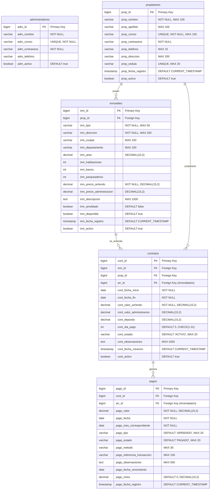

# 💾 Esquema de Base de Datos

Esta documentación describe el esquema completo de la base de datos del sistema de gestión de arrendamientos.

## 📋 Índice

- [🎯 Visión General](#-visión-general)
- [📊 Diagrama Entidad-Relación](#-diagrama-entidad-relación)
- [📋 Descripción de Tablas](#-descripción-de-tablas)
- [🔗 Relaciones](#-relaciones)
- [📇 Índices](#-índices)
- [🔒 Restricciones](#-restricciones)
- [📈 Optimizaciones](#-optimizaciones)

---

## 🎯 Visión General

### Características de la Base de Datos

- **Motor**: PostgreSQL 15
- **Charset**: UTF-8
- **Timezone**: UTC
- **Schema**: Public
- **Naming Convention**: snake_case con prefijos por tabla

### Principios de Diseño

1. **Normalización**: 3NF para evitar redundancia
2. **Prefijos**: Cada tabla usa prefijo específico (adm_, prop_, inm_, etc.)
3. **Timestamps**: Campos de auditoría en todas las tablas
4. **Soft Delete**: Columnas `activo` para borrado lógico
5. **Primary Keys**: BIGINT IDENTITY para escalabilidad

---

## 📊 Diagrama Entidad-Relación



---

## 📋 Descripción de Tablas

### 🔐 administradores

Almacena información de administradores del sistema.

```sql
CREATE TABLE administradores (
    adm_id BIGINT GENERATED ALWAYS AS IDENTITY PRIMARY KEY,
    adm_nombre VARCHAR(100) NOT NULL,
    adm_correo VARCHAR(150) NOT NULL UNIQUE,
    adm_contrasena VARCHAR(255) NOT NULL,
    adm_telefono VARCHAR(15),
    adm_activo BOOLEAN DEFAULT true
);
```

| Campo | Tipo | Restricciones | Descripción |
|-------|------|---------------|-------------|
| `adm_id` | BIGINT | PK, IDENTITY | Identificador único |
| `adm_nombre` | VARCHAR(100) | NOT NULL | Nombre completo |
| `adm_correo` | VARCHAR(150) | NOT NULL, UNIQUE | Email de acceso |
| `adm_contrasena` | VARCHAR(255) | NOT NULL | Password encriptado (BCrypt) |
| `adm_telefono` | VARCHAR(15) | - | Teléfono de contacto |
| `adm_activo` | BOOLEAN | DEFAULT true | Estado del administrador |

### 👤 propietarios

Información de propietarios de inmuebles.

```sql
CREATE TABLE propietarios (
    prop_id BIGINT GENERATED ALWAYS AS IDENTITY PRIMARY KEY,
    prop_nombre VARCHAR(100) NOT NULL,
    prop_apellido VARCHAR(100),
    prop_correo VARCHAR(150) NOT NULL UNIQUE,
    prop_contrasena VARCHAR(255) NOT NULL,
    prop_telefono VARCHAR(15),
    prop_direccion VARCHAR(200),
    prop_cedula VARCHAR(20) UNIQUE,
    prop_fecha_registro TIMESTAMP DEFAULT CURRENT_TIMESTAMP,
    prop_activo BOOLEAN DEFAULT true
);
```

| Campo | Tipo | Restricciones | Descripción |
|-------|------|---------------|-------------|
| `prop_id` | BIGINT | PK, IDENTITY | Identificador único |
| `prop_nombre` | VARCHAR(100) | NOT NULL | Primer nombre |
| `prop_apellido` | VARCHAR(100) | - | Apellidos |
| `prop_correo` | VARCHAR(150) | NOT NULL, UNIQUE | Email único |
| `prop_contrasena` | VARCHAR(255) | NOT NULL | Password encriptado |
| `prop_telefono` | VARCHAR(15) | - | Número telefónico |
| `prop_direccion` | VARCHAR(200) | - | Dirección de residencia |
| `prop_cedula` | VARCHAR(20) | UNIQUE | Documento de identidad |
| `prop_fecha_registro` | TIMESTAMP | DEFAULT NOW() | Fecha de registro |
| `prop_activo` | BOOLEAN | DEFAULT true | Estado del propietario |

### 🏠 inmuebles

Catálogo de propiedades disponibles para arriendo.

```sql
CREATE TABLE inmuebles (
    inm_id BIGINT GENERATED ALWAYS AS IDENTITY PRIMARY KEY,
    prop_id BIGINT NOT NULL REFERENCES propietarios(prop_id),
    inm_tipo VARCHAR(50) NOT NULL,
    inm_direccion VARCHAR(200) NOT NULL,
    inm_ciudad VARCHAR(100),
    inm_departamento VARCHAR(100),
    inm_area DECIMAL(10,2),
    inm_habitaciones INTEGER,
    inm_banos INTEGER,
    inm_parqueaderos INTEGER,
    inm_precio_arriendo DECIMAL(15,2) NOT NULL CHECK (inm_precio_arriendo > 0),
    inm_precio_administracion DECIMAL(15,2),
    inm_descripcion TEXT,
    inm_amoblado BOOLEAN DEFAULT false,
    inm_disponible BOOLEAN DEFAULT true,
    inm_fecha_registro TIMESTAMP DEFAULT CURRENT_TIMESTAMP,
    inm_activo BOOLEAN DEFAULT true
);
```

| Campo | Tipo | Restricciones | Descripción |
|-------|------|---------------|-------------|
| `inm_id` | BIGINT | PK, IDENTITY | Identificador único |
| `prop_id` | BIGINT | FK, NOT NULL | Referencia al propietario |
| `inm_tipo` | VARCHAR(50) | NOT NULL | Tipo (Casa, Apto, Local, etc.) |
| `inm_direccion` | VARCHAR(200) | NOT NULL | Dirección completa |
| `inm_ciudad` | VARCHAR(100) | - | Ciudad |
| `inm_departamento` | VARCHAR(100) | - | Departamento/Estado |
| `inm_area` | DECIMAL(10,2) | - | Área en m² |
| `inm_habitaciones` | INTEGER | - | Número de habitaciones |
| `inm_banos` | INTEGER | - | Número de baños |
| `inm_parqueaderos` | INTEGER | - | Número de parqueaderos |
| `inm_precio_arriendo` | DECIMAL(15,2) | NOT NULL, >0 | Precio mensual |
| `inm_precio_administracion` | DECIMAL(15,2) | - | Costo administración |
| `inm_descripcion` | TEXT | - | Descripción detallada |
| `inm_amoblado` | BOOLEAN | DEFAULT false | Si está amoblado |
| `inm_disponible` | BOOLEAN | DEFAULT true | Disponibilidad |
| `inm_fecha_registro` | TIMESTAMP | DEFAULT NOW() | Fecha de registro |
| `inm_activo` | BOOLEAN | DEFAULT true | Estado del inmueble |

### 📋 contratos

Contratos de arrendamiento entre propietarios y arrendatarios.

```sql
CREATE TABLE contratos (
    cont_id BIGINT GENERATED ALWAYS AS IDENTITY PRIMARY KEY,
    inm_id BIGINT NOT NULL REFERENCES inmuebles(inm_id),
    prop_id BIGINT NOT NULL REFERENCES propietarios(prop_id),
    arr_id BIGINT NOT NULL, -- Referencias externas manejadas por lógica
    cont_fecha_inicio DATE NOT NULL,
    cont_fecha_fin DATE NOT NULL,
    cont_valor_arriendo DECIMAL(15,2) NOT NULL CHECK (cont_valor_arriendo > 0),
    cont_valor_administracion DECIMAL(15,2),
    cont_deposito DECIMAL(15,2),
    cont_dia_pago INTEGER DEFAULT 5 CHECK (cont_dia_pago BETWEEN 1 AND 31),
    cont_estado VARCHAR(20) DEFAULT 'ACTIVO' CHECK (cont_estado IN ('ACTIVO', 'FINALIZADO', 'CANCELADO', 'SUSPENDIDO')),
    cont_observaciones TEXT,
    cont_fecha_creacion TIMESTAMP DEFAULT CURRENT_TIMESTAMP,
    cont_activo BOOLEAN DEFAULT true,
    CONSTRAINT fechas_validas CHECK (cont_fecha_fin > cont_fecha_inicio)
);
```

| Campo | Tipo | Restricciones | Descripción |
|-------|------|---------------|-------------|
| `cont_id` | BIGINT | PK, IDENTITY | Identificador único |
| `inm_id` | BIGINT | FK, NOT NULL | Referencia al inmueble |
| `prop_id` | BIGINT | FK, NOT NULL | Referencia al propietario |
| `arr_id` | BIGINT | NOT NULL | ID del arrendatario (externo) |
| `cont_fecha_inicio` | DATE | NOT NULL | Fecha inicio contrato |
| `cont_fecha_fin` | DATE | NOT NULL | Fecha fin contrato |
| `cont_valor_arriendo` | DECIMAL(15,2) | NOT NULL, >0 | Valor mensual arriendo |
| `cont_valor_administracion` | DECIMAL(15,2) | - | Valor administración |
| `cont_deposito` | DECIMAL(15,2) | - | Depósito de garantía |
| `cont_dia_pago` | INTEGER | 1-31, DEFAULT 5 | Día de pago mensual |
| `cont_estado` | VARCHAR(20) | ENUM, DEFAULT 'ACTIVO' | Estado del contrato |
| `cont_observaciones` | TEXT | - | Observaciones adicionales |
| `cont_fecha_creacion` | TIMESTAMP | DEFAULT NOW() | Fecha de creación |
| `cont_activo` | BOOLEAN | DEFAULT true | Estado lógico |

### 💰 pagos

Registro de pagos realizados por los arrendatarios.

```sql
CREATE TABLE pagos (
    pago_id BIGINT GENERATED ALWAYS AS IDENTITY PRIMARY KEY,
    cont_id BIGINT NOT NULL REFERENCES contratos(cont_id),
    arr_id BIGINT NOT NULL,
    pago_valor DECIMAL(15,2) NOT NULL CHECK (pago_valor > 0),
    pago_fecha DATE NOT NULL,
    pago_mes_correspondiente DATE NOT NULL,
    pago_tipo VARCHAR(20) DEFAULT 'ARRIENDO' CHECK (pago_tipo IN ('ARRIENDO', 'ADMINISTRACION', 'DEPOSITO', 'MORA', 'SERVICIOS_PUBLICOS', 'OTROS')),
    pago_estado VARCHAR(20) DEFAULT 'PAGADO' CHECK (pago_estado IN ('PENDIENTE', 'PAGADO', 'VENCIDO', 'PARCIAL')),
    pago_metodo VARCHAR(30) CHECK (pago_metodo IN ('EFECTIVO', 'TRANSFERENCIA_BANCARIA', 'CHEQUE', 'TARJETA_CREDITO', 'TARJETA_DEBITO', 'PSE', 'NEQUI', 'DAVIPLATA')),
    pago_referencia_transaccion VARCHAR(100),
    pago_observaciones TEXT,
    pago_fecha_vencimiento DATE,
    pago_mora DECIMAL(15,2) DEFAULT 0,
    pago_fecha_registro TIMESTAMP DEFAULT CURRENT_TIMESTAMP
);
```

| Campo | Tipo | Restricciones | Descripción |
|-------|------|---------------|-------------|
| `pago_id` | BIGINT | PK, IDENTITY | Identificador único |
| `cont_id` | BIGINT | FK, NOT NULL | Referencia al contrato |
| `arr_id` | BIGINT | NOT NULL | ID del arrendatario |
| `pago_valor` | DECIMAL(15,2) | NOT NULL, >0 | Valor del pago |
| `pago_fecha` | DATE | NOT NULL | Fecha del pago |
| `pago_mes_correspondiente` | DATE | NOT NULL | Mes al que corresponde |
| `pago_tipo` | VARCHAR(20) | ENUM, DEFAULT 'ARRIENDO' | Tipo de pago |
| `pago_estado` | VARCHAR(20) | ENUM, DEFAULT 'PAGADO' | Estado del pago |
| `pago_metodo` | VARCHAR(30) | ENUM | Método de pago |
| `pago_referencia_transaccion` | VARCHAR(100) | - | Referencia bancaria |
| `pago_observaciones` | TEXT | - | Observaciones |
| `pago_fecha_vencimiento` | DATE | - | Fecha límite de pago |
| `pago_mora` | DECIMAL(15,2) | DEFAULT 0 | Valor de mora |
| `pago_fecha_registro` | TIMESTAMP | DEFAULT NOW() | Fecha de registro |

---

## 🔗 Relaciones

### Relaciones Implementadas

```sql
-- Inmuebles -> Propietarios (Muchos a Uno)
ALTER TABLE inmuebles 
ADD CONSTRAINT fk_inmuebles_propietarios 
FOREIGN KEY (prop_id) REFERENCES propietarios(prop_id);

-- Contratos -> Inmuebles (Muchos a Uno)
ALTER TABLE contratos 
ADD CONSTRAINT fk_contratos_inmuebles 
FOREIGN KEY (inm_id) REFERENCES inmuebles(inm_id);

-- Contratos -> Propietarios (Muchos a Uno)
ALTER TABLE contratos 
ADD CONSTRAINT fk_contratos_propietarios 
FOREIGN KEY (prop_id) REFERENCES propietarios(prop_id);

-- Pagos -> Contratos (Muchos a Uno)
ALTER TABLE pagos 
ADD CONSTRAINT fk_pagos_contratos 
FOREIGN KEY (cont_id) REFERENCES contratos(cont_id);
```

### Relaciones Lógicas (Sin FK)

Algunas relaciones se manejan a nivel de aplicación:

- `contratos.arr_id` → Arrendatarios (microservicio externo)
- `pagos.arr_id` → Arrendatarios (microservicio externo)

---

## 📇 Índices

### Índices Automáticos

```sql
-- Primary Keys (automáticos)
CREATE INDEX administradores_pkey ON administradores(adm_id);
CREATE INDEX propietarios_pkey ON propietarios(prop_id);
CREATE INDEX inmuebles_pkey ON inmuebles(inm_id);
CREATE INDEX contratos_pkey ON contratos(cont_id);
CREATE INDEX pagos_pkey ON pagos(pago_id);

-- Unique Constraints (automáticos)
CREATE UNIQUE INDEX administradores_correo_unique ON administradores(adm_correo);
CREATE UNIQUE INDEX propietarios_correo_unique ON propietarios(prop_correo);
CREATE UNIQUE INDEX propietarios_cedula_unique ON propietarios(prop_cedula);
```

### Índices Adicionales Recomendados

```sql
-- Índices para Foreign Keys
CREATE INDEX idx_inmuebles_propietario ON inmuebles(prop_id);
CREATE INDEX idx_contratos_inmueble ON contratos(inm_id);
CREATE INDEX idx_contratos_propietario ON contratos(prop_id);
CREATE INDEX idx_contratos_arrendatario ON contratos(arr_id);
CREATE INDEX idx_pagos_contrato ON pagos(cont_id);
CREATE INDEX idx_pagos_arrendatario ON pagos(arr_id);

-- Índices para búsquedas frecuentes
CREATE INDEX idx_inmuebles_ciudad ON inmuebles(inm_ciudad);
CREATE INDEX idx_inmuebles_tipo ON inmuebles(inm_tipo);
CREATE INDEX idx_inmuebles_disponible ON inmuebles(inm_disponible) WHERE inm_disponible = true;
CREATE INDEX idx_inmuebles_precio ON inmuebles(inm_precio_arriendo);

CREATE INDEX idx_contratos_estado ON contratos(cont_estado);
CREATE INDEX idx_contratos_fechas ON contratos(cont_fecha_inicio, cont_fecha_fin);

CREATE INDEX idx_pagos_estado ON pagos(pago_estado);
CREATE INDEX idx_pagos_fecha ON pagos(pago_fecha);
CREATE INDEX idx_pagos_mes_correspondiente ON pagos(pago_mes_correspondiente);
CREATE INDEX idx_pagos_vencimiento ON pagos(pago_fecha_vencimiento) WHERE pago_fecha_vencimiento IS NOT NULL;

-- Índices compuestos
CREATE INDEX idx_contratos_inmueble_estado ON contratos(inm_id, cont_estado);
CREATE INDEX idx_pagos_contrato_mes ON pagos(cont_id, pago_mes_correspondiente);
```

---

## 🔒 Restricciones

### Check Constraints

```sql
-- Validaciones de rango
ALTER TABLE contratos 
ADD CONSTRAINT check_dia_pago 
CHECK (cont_dia_pago BETWEEN 1 AND 31);

ALTER TABLE contratos 
ADD CONSTRAINT check_fechas_validas 
CHECK (cont_fecha_fin > cont_fecha_inicio);

-- Validaciones de estado
ALTER TABLE contratos 
ADD CONSTRAINT check_estado_valido 
CHECK (cont_estado IN ('ACTIVO', 'FINALIZADO', 'CANCELADO', 'SUSPENDIDO'));

ALTER TABLE pagos 
ADD CONSTRAINT check_tipo_pago 
CHECK (pago_tipo IN ('ARRIENDO', 'ADMINISTRACION', 'DEPOSITO', 'MORA', 'SERVICIOS_PUBLICOS', 'OTROS'));

ALTER TABLE pagos 
ADD CONSTRAINT check_estado_pago 
CHECK (pago_estado IN ('PENDIENTE', 'PAGADO', 'VENCIDO', 'PARCIAL'));

-- Validaciones de valores
ALTER TABLE inmuebles 
ADD CONSTRAINT check_precio_positivo 
CHECK (inm_precio_arriendo > 0);

ALTER TABLE contratos 
ADD CONSTRAINT check_valor_positivo 
CHECK (cont_valor_arriendo > 0);

ALTER TABLE pagos 
ADD CONSTRAINT check_pago_positivo 
CHECK (pago_valor > 0);
```

### Triggers de Auditoría (Futuro)

```sql
-- Función para timestamps automáticos
CREATE OR REPLACE FUNCTION update_modified_column()
RETURNS TRIGGER AS $$
BEGIN
    NEW.modified_at = CURRENT_TIMESTAMP;
    RETURN NEW;
END;
$$ language 'plpgsql';

-- Trigger para actualizar fechas de modificación
CREATE TRIGGER update_propietarios_modtime 
    BEFORE UPDATE ON propietarios 
    FOR EACH ROW EXECUTE FUNCTION update_modified_column();
```

---

## 📈 Optimizaciones

### Particionamiento (Futuro)

Para tablas con alto volumen:

```sql
-- Particionamiento por fecha en tabla pagos
CREATE TABLE pagos_2024 PARTITION OF pagos
    FOR VALUES FROM ('2024-01-01') TO ('2025-01-01');
    
CREATE TABLE pagos_2025 PARTITION OF pagos
    FOR VALUES FROM ('2025-01-01') TO ('2026-01-01');
```

### Configuración PostgreSQL

```sql
-- postgresql.conf optimizaciones recomendadas
shared_buffers = 256MB
effective_cache_size = 1GB
maintenance_work_mem = 64MB
checkpoint_completion_target = 0.9
wal_buffers = 16MB
default_statistics_target = 100
random_page_cost = 1.1
effective_io_concurrency = 200
```

### Consultas Optimizadas

```sql
-- Búsqueda eficiente de inmuebles disponibles
SELECT i.*, p.prop_nombre, p.prop_telefono
FROM inmuebles i
JOIN propietarios p ON i.prop_id = p.prop_id
WHERE i.inm_disponible = true 
  AND i.inm_activo = true
  AND p.prop_activo = true
ORDER BY i.inm_precio_arriendo;

-- Reporte de pagos pendientes
SELECT c.cont_id, i.inm_direccion, p.prop_nombre,
       COUNT(pa.pago_id) as pagos_pendientes,
       SUM(pa.pago_valor) as valor_total
FROM contratos c
JOIN inmuebles i ON c.inm_id = i.inm_id
JOIN propietarios p ON c.prop_id = p.prop_id
LEFT JOIN pagos pa ON c.cont_id = pa.cont_id AND pa.pago_estado = 'PENDIENTE'
WHERE c.cont_estado = 'ACTIVO'
GROUP BY c.cont_id, i.inm_direccion, p.prop_nombre
HAVING COUNT(pa.pago_id) > 0;
```

### Backup y Mantenimiento

```sql
-- Backup automatizado
pg_dump -h localhost -U arrendamiento_user -d arrendamiento_db > backup_$(date +%Y%m%d).sql

-- Mantenimiento de índices
REINDEX DATABASE arrendamiento_db;

-- Actualizar estadísticas
ANALYZE;

-- Limpiar datos obsoletos
VACUUM ANALYZE;
```

---

## 🔧 Scripts de Inicialización

### Datos de Ejemplo

```sql
-- Insertar administrador por defecto
INSERT INTO administradores (adm_nombre, adm_correo, adm_contrasena)
VALUES ('Administrador Sistema', 'admin@sistema.com', '$2a$10$...');

-- Insertar propietario de ejemplo
INSERT INTO propietarios (prop_nombre, prop_apellido, prop_correo, prop_contrasena, prop_telefono, prop_cedula)
VALUES ('Juan Carlos', 'Pérez López', 'juan.perez@email.com', '$2a$10$...', '3001234567', '12345678');

-- Insertar inmueble de ejemplo
INSERT INTO inmuebles (prop_id, inm_tipo, inm_direccion, inm_ciudad, inm_precio_arriendo)
VALUES (1, 'Apartamento', 'Carrera 15 #85-42, Apto 501', 'Bogotá', 1500000);
```

Esta estructura de base de datos proporciona una base sólida y escalable para el sistema de gestión de arrendamientos, con optimizaciones y restricciones que garantizan la integridad de los datos.
