# 🐳 Guía de Docker

Esta documentación describe cómo utilizar Docker y Docker Compose para el desarrollo, testing y despliegue del sistema de arrendamientos.

## 📋 Índice

- [🎯 Visión General](#-visión-general)
- [🐳 Configuración Docker](#-configuración-docker)
- [🔧 Docker Compose](#-docker-compose)
- [🚀 Comandos Útiles](#-comandos-útiles)
- [📊 Monitoreo](#-monitoreo)
- [🔧 Troubleshooting](#-troubleshooting)

---

## 🎯 Visión General

### Arquitectura de Contenedores

```mermaid
graph TB
    subgraph "Docker Network: arrendamiento-network"
        subgraph "Database Layer"
            PG[PostgreSQL Container<br/>:5432]
        end
        
        subgraph "Application Layer"
            ADM[Administración Service<br/>:8081]
            PROP[Propietarios Service<br/>:8082]
            INM[Inmuebles Service<br/>:8083]
            CONT[Contratos Service<br/>:8084]
            PAG[Pagos Service<br/>:8085]
        end
        
        subgraph "Volumes"
            VPG[(postgres_data)]
        end
    end
    
    PG --> VPG
    ADM --> PG
    PROP --> PG
    INM --> PG
    CONT --> PG
    PAG --> PG
    
    CONT --> PROP
    CONT --> INM
    PAG --> CONT
```



### Beneficios de Docker

- **Portabilidad**: Ejecuta en cualquier entorno con Docker
- **Aislamiento**: Cada servicio en su propio contenedor
- **Escalabilidad**: Fácil escalado horizontal de servicios
- **Consistencia**: Mismo entorno en desarrollo y producción
- **Simplicidad**: Setup de entorno con un comando

---

## 🐳 Configuración Docker

### Dockerfiles por Servicio

#### Administración Service

```dockerfile
FROM openjdk:17-jdk-slim

LABEL maintainer="equipo-desarrollo@empresa.com"
LABEL description="Microservicio de Administración"
LABEL version="1.0.0"

# Variables de entorno
ENV JAVA_OPTS="-Xmx256m -Xms128m"
ENV SPRING_PROFILES_ACTIVE=docker

# Crear usuario no-root para seguridad
RUN addgroup --system appgroup && adduser --system --group appuser

# Directorio de trabajo
WORKDIR /app

# Copiar JAR
COPY target/administracion-service-1.0.0.jar app.jar

# Cambiar propietario
RUN chown appuser:appgroup app.jar

# Cambiar a usuario no-root
USER appuser

# Health check
HEALTHCHECK --interval=30s --timeout=10s --start-period=60s --retries=3 \
  CMD curl -f http://localhost:8080/actuator/health || exit 1

# Exponer puerto
EXPOSE 8080

# Comando de inicio
ENTRYPOINT ["java", "-jar", "app.jar"]
```

#### Dockerfile Multi-stage (Optimizado)

```dockerfile
# Build stage
FROM maven:3.9.0-openjdk-17-slim AS build
WORKDIR /app
COPY pom.xml .
COPY src ./src
RUN mvn clean package -DskipTests

# Runtime stage
FROM openjdk:17-jdk-slim
WORKDIR /app
COPY --from=build /app/target/administracion-service-1.0.0.jar app.jar

EXPOSE 8080
ENTRYPOINT ["java", "-jar", "app.jar"]
```

### .dockerignore

```dockerignore
# Build artifacts
target/
*.jar
*.war

# IDE files
.idea/
.vscode/
*.iml

# OS files
.DS_Store
Thumbs.db

# Version control
.git/
.gitignore

# Documentation
*.md
docs/

# Tests
src/test/

# Maven
.m2/
```

---

## 🔧 Docker Compose

### docker-compose.yml Principal

```yaml
version: '3.8'

services:
  # Base de datos PostgreSQL
  postgres-db:
    image: postgres:15-alpine
    container_name: postgres-arrendamiento
    restart: unless-stopped
    environment:
      POSTGRES_DB: ${POSTGRES_DB:-arrendamiento_db}
      POSTGRES_USER: ${POSTGRES_USER:-arrendamiento_user}
      POSTGRES_PASSWORD: ${POSTGRES_PASSWORD:-arrendamiento_pass}
      POSTGRES_INITDB_ARGS: "--encoding=UTF8 --locale=C"
    ports:
      - "5432:5432"
    volumes:
      - postgres_data:/var/lib/postgresql/data
      - ./init-scripts:/docker-entrypoint-initdb.d:ro
    networks:
      - arrendamiento-network
    healthcheck:
      test: ["CMD-SHELL", "pg_isready -U ${POSTGRES_USER:-arrendamiento_user}"]
      interval: 10s
      timeout: 5s
      retries: 5

  # Microservicio de Administración
  administracion-service:
    build:
      context: ./administracion-service
      dockerfile: Dockerfile
    container_name: administracion-service
    restart: unless-stopped
    ports:
      - "8081:8080"
    environment:
      - SPRING_PROFILES_ACTIVE=docker
      - SPRING_DATASOURCE_URL=jdbc:postgresql://postgres-db:5432/${POSTGRES_DB:-arrendamiento_db}
      - SPRING_DATASOURCE_USERNAME=${POSTGRES_USER:-arrendamiento_user}
      - SPRING_DATASOURCE_PASSWORD=${POSTGRES_PASSWORD:-arrendamiento_pass}
      - JWT_SECRET=${JWT_SECRET:-myVerySecretKeyForArrendamientoAdministracion2023}
    depends_on:
      postgres-db:
        condition: service_healthy
    networks:
      - arrendamiento-network
    healthcheck:
      test: ["CMD", "curl", "-f", "http://localhost:8080/actuator/health"]
      interval: 30s
      timeout: 10s
      retries: 3
      start_period: 60s
    deploy:
      resources:
        limits:
          cpus: '0.5'
          memory: 512M
        reservations:
          cpus: '0.2'
          memory: 256M

  # Microservicio de Propietarios
  propietarios-service:
    build:
      context: ./propietarios-service
      dockerfile: Dockerfile
    container_name: propietarios-service
    restart: unless-stopped
    ports:
      - "8082:8080"
    environment:
      - SPRING_PROFILES_ACTIVE=docker
      - SPRING_DATASOURCE_URL=jdbc:postgresql://postgres-db:5432/${POSTGRES_DB:-arrendamiento_db}
      - SPRING_DATASOURCE_USERNAME=${POSTGRES_USER:-arrendamiento_user}
      - SPRING_DATASOURCE_PASSWORD=${POSTGRES_PASSWORD:-arrendamiento_pass}
    depends_on:
      postgres-db:
        condition: service_healthy
    networks:
      - arrendamiento-network
    healthcheck:
      test: ["CMD", "curl", "-f", "http://localhost:8080/actuator/health"]
      interval: 30s
      timeout: 10s
      retries: 3
      start_period: 60s
    deploy:
      resources:
        limits:
          cpus: '0.5'
          memory: 512M
        reservations:
          cpus: '0.2'
          memory: 256M

  # Microservicio de Inmuebles
  inmuebles-service:
    build:
      context: ./inmuebles-service
      dockerfile: Dockerfile
    container_name: inmuebles-service
    restart: unless-stopped
    ports:
      - "8083:8080"
    environment:
      - SPRING_PROFILES_ACTIVE=docker
      - SPRING_DATASOURCE_URL=jdbc:postgresql://postgres-db:5432/${POSTGRES_DB:-arrendamiento_db}
      - SPRING_DATASOURCE_USERNAME=${POSTGRES_USER:-arrendamiento_user}
      - SPRING_DATASOURCE_PASSWORD=${POSTGRES_PASSWORD:-arrendamiento_pass}
    depends_on:
      postgres-db:
        condition: service_healthy
    networks:
      - arrendamiento-network
    healthcheck:
      test: ["CMD", "curl", "-f", "http://localhost:8080/actuator/health"]
      interval: 30s
      timeout: 10s
      retries: 3
      start_period: 60s
    deploy:
      resources:
        limits:
          cpus: '0.5'
          memory: 512M
        reservations:
          cpus: '0.2'
          memory: 256M

  # Microservicio de Contratos
  contratos-service:
    build:
      context: ./contratos-service
      dockerfile: Dockerfile
    container_name: contratos-service
    restart: unless-stopped
    ports:
      - "8084:8080"
    environment:
      - SPRING_PROFILES_ACTIVE=docker
      - SPRING_DATASOURCE_URL=jdbc:postgresql://postgres-db:5432/${POSTGRES_DB:-arrendamiento_db}
      - SPRING_DATASOURCE_USERNAME=${POSTGRES_USER:-arrendamiento_user}
      - SPRING_DATASOURCE_PASSWORD=${POSTGRES_PASSWORD:-arrendamiento_pass}
      - PROPIETARIOS_SERVICE_URL=http://propietarios-service:8080
      - INMUEBLES_SERVICE_URL=http://inmuebles-service:8080
    depends_on:
      postgres-db:
        condition: service_healthy
      propietarios-service:
        condition: service_healthy
      inmuebles-service:
        condition: service_healthy
    networks:
      - arrendamiento-network
    healthcheck:
      test: ["CMD", "curl", "-f", "http://localhost:8080/actuator/health"]
      interval: 30s
      timeout: 10s
      retries: 3
      start_period: 60s
    deploy:
      resources:
        limits:
          cpus: '0.5'
          memory: 512M
        reservations:
          cpus: '0.2'
          memory: 256M

  # Microservicio de Pagos
  pagos-service:
    build:
      context: ./pagos-service
      dockerfile: Dockerfile
    container_name: pagos-service
    restart: unless-stopped
    ports:
      - "8085:8080"
    environment:
      - SPRING_PROFILES_ACTIVE=docker
      - SPRING_DATASOURCE_URL=jdbc:postgresql://postgres-db:5432/${POSTGRES_DB:-arrendamiento_db}
      - SPRING_DATASOURCE_USERNAME=${POSTGRES_USER:-arrendamiento_user}
      - SPRING_DATASOURCE_PASSWORD=${POSTGRES_PASSWORD:-arrendamiento_pass}
      - CONTRATOS_SERVICE_URL=http://contratos-service:8080
    depends_on:
      postgres-db:
        condition: service_healthy
      contratos-service:
        condition: service_healthy
    networks:
      - arrendamiento-network
    healthcheck:
      test: ["CMD", "curl", "-f", "http://localhost:8080/actuator/health"]
      interval: 30s
      timeout: 10s
      retries: 3
      start_period: 60s
    deploy:
      resources:
        limits:
          cpus: '0.5'
          memory: 512M
        reservations:
          cpus: '0.2'
          memory: 256M

# Volumes persistentes
volumes:
  postgres_data:
    driver: local

# Redes
networks:
  arrendamiento-network:
    driver: bridge
    ipam:
      driver: default
      config:
        - subnet: 172.20.0.0/16
```

### docker-compose.override.yml (Desarrollo)

```yaml
version: '3.8'

services:
  postgres-db:
    ports:
      - "5432:5432"
    environment:
      - POSTGRES_DB=arrendamiento_dev_db
    volumes:
      - ./init-scripts/dev-data.sql:/docker-entrypoint-initdb.d/dev-data.sql:ro

  administracion-service:
    environment:
      - SPRING_PROFILES_ACTIVE=dev
      - LOGGING_LEVEL_COM_ARRENDAMIENTO=DEBUG
    volumes:
      - ./administracion-service/target:/app/target

  propietarios-service:
    environment:
      - SPRING_PROFILES_ACTIVE=dev
      - LOGGING_LEVEL_COM_ARRENDAMIENTO=DEBUG
    volumes:
      - ./propietarios-service/target:/app/target
```

### docker-compose.prod.yml (Producción)

```yaml
version: '3.8'

services:
  postgres-db:
    restart: always
    environment:
      - POSTGRES_DB=arrendamiento_prod_db
    volumes:
      - postgres_prod_data:/var/lib/postgresql/data
      - ./backups:/backups

  # Configuraciones de producción para todos los servicios
  administracion-service:
    environment:
      - SPRING_PROFILES_ACTIVE=prod
      - JAVA_OPTS=-Xmx512m -Xms256m -XX:+UseG1GC
    deploy:
      replicas: 2
      resources:
        limits:
          cpus: '1.0'
          memory: 1G
        reservations:
          cpus: '0.5'
          memory: 512M
      restart_policy:
        condition: on-failure
        delay: 5s
        max_attempts: 3

volumes:
  postgres_prod_data:
    driver: local
```

---

## 🚀 Comandos Útiles

### Comandos Básicos

```bash
# Construir todas las imágenes
docker-compose build

# Construir sin cache
docker-compose build --no-cache

# Levantar todos los servicios
docker-compose up -d

# Ver logs de todos los servicios
docker-compose logs -f

# Ver logs de un servicio específico
docker-compose logs -f propietarios-service

# Parar todos los servicios
docker-compose stop

# Parar y eliminar contenedores
docker-compose down

# Parar y eliminar contenedores + volúmenes
docker-compose down -v
```

### Comandos de Desarrollo

```bash
# Levantar solo la base de datos
docker-compose up -d postgres-db

# Reconstruir y levantar un servicio específico
docker-compose up --build propietarios-service

# Escalar un servicio
docker-compose up -d --scale propietarios-service=3

# Ejecutar comando en contenedor
docker-compose exec propietarios-service bash

# Ver estado de servicios
docker-compose ps

# Ver configuración efectiva
docker-compose config
```

### Scripts de Automatización

#### `docker-dev.sh`

```bash
#!/bin/bash
set -e

echo "🐳 Iniciando entorno de desarrollo con Docker..."

# Limpiar contenedores anteriores
docker-compose down -v

# Construir imágenes
echo "📦 Construyendo imágenes..."
docker-compose build

# Levantar servicios en orden
echo "🚀 Levantando servicios..."
docker-compose up -d postgres-db

echo "⏳ Esperando que PostgreSQL esté listo..."
sleep 10

docker-compose up -d administracion-service propietarios-service inmuebles-service

echo "⏳ Esperando servicios básicos..."
sleep 15

docker-compose up -d contratos-service pagos-service

echo "✅ Entorno listo!"
echo "📊 Estado de los servicios:"
docker-compose ps
```

#### `docker-health-check.sh`

```bash
#!/bin/bash

services=("administracion-service" "propietarios-service" "inmuebles-service" "contratos-service" "pagos-service")
ports=("8081" "8082" "8083" "8084" "8085")

echo "🔍 Verificando salud de microservicios..."

for i in "${!services[@]}"; do
    service=${services[$i]}
    port=${ports[$i]}
    
    if curl -f -s "http://localhost:${port}/actuator/health" > /dev/null; then
        echo "✅ ${service}: HEALTHY"
    else
        echo "❌ ${service}: UNHEALTHY"
    fi
done
```

---

## 📊 Monitoreo

### Health Checks

```yaml
# En docker-compose.yml
healthcheck:
  test: ["CMD", "curl", "-f", "http://localhost:8080/actuator/health"]
  interval: 30s    # Frecuencia de verificación
  timeout: 10s     # Timeout por check
  retries: 3       # Reintentos antes de marcar como unhealthy
  start_period: 60s # Tiempo de gracia al iniciar
```

### Monitoreo de Recursos

```bash
# Ver uso de recursos
docker stats

# Ver uso de recursos específico
docker stats propietarios-service

# Ver logs con timestamps
docker-compose logs -f -t propietarios-service

# Ver últimas N líneas de logs
docker-compose logs --tail=50 propietarios-service
```

### Métricas con Docker

```yaml
# docker-compose.monitoring.yml
version: '3.8'

services:
  prometheus:
    image: prom/prometheus:latest
    container_name: prometheus
    ports:
      - "9090:9090"
    volumes:
      - ./monitoring/prometheus.yml:/etc/prometheus/prometheus.yml
    networks:
      - arrendamiento-network

  grafana:
    image: grafana/grafana:latest
    container_name: grafana
    ports:
      - "3000:3000"
    environment:
      - GF_SECURITY_ADMIN_PASSWORD=admin
    volumes:
      - grafana_data:/var/lib/grafana
    networks:
      - arrendamiento-network

volumes:
  grafana_data:
```

---

## 🔧 Troubleshooting

### Problemas Comunes

#### 1. **Puerto ya en uso**

```bash
# Error: Port 8082 is already in use
# Solución: Cambiar puerto o liberar el puerto ocupado

# Ver qué proceso usa el puerto
lsof -i :8082

# Matar proceso
kill -9 <PID>

# O cambiar puerto en docker-compose.yml
ports:
  - "8092:8080"  # Puerto externo diferente
```

#### 2. **Contenedor no inicia**

```bash
# Ver logs detallados
docker-compose logs propietarios-service

# Conectar al contenedor para debug
docker-compose exec propietarios-service bash

# Ver configuración de Spring
docker-compose exec propietarios-service env | grep SPRING
```

#### 3. **Problemas de conectividad entre servicios**

```bash
# Verificar red
docker network ls
docker network inspect microservicios_arrendamiento-network

# Test de conectividad entre contenedores
docker-compose exec contratos-service ping propietarios-service

# Verificar DNS interno
docker-compose exec contratos-service nslookup propietarios-service
```

#### 4. **Base de datos no se conecta**

```bash
# Verificar que PostgreSQL esté corriendo
docker-compose ps postgres-db

# Conectar a la base de datos
docker-compose exec postgres-db psql -U arrendamiento_user -d arrendamiento_db

# Ver logs de PostgreSQL
docker-compose logs postgres-db

# Verificar variables de entorno
docker-compose exec postgres-db env | grep POSTGRES
```

#### 5. **Problemas de memoria**

```bash
# Ver uso de memoria
docker stats --no-stream

# Configurar límites de memoria
deploy:
  resources:
    limits:
      memory: 512M
    reservations:
      memory: 256M
```

### Scripts de Diagnóstico

#### `docker-diagnose.sh`

```bash
#!/bin/bash

echo "🔍 DIAGNÓSTICO DE DOCKER"
echo "========================"

echo "📊 Estado de contenedores:"
docker-compose ps

echo -e "\n🔌 Conectividad de red:"
docker network ls | grep arrendamiento

echo -e "\n💾 Uso de volúmenes:"
docker volume ls | grep postgres

echo -e "\n🖥️ Uso de recursos:"
docker stats --no-stream --format "table {{.Container}}\t{{.CPUPerc}}\t{{.MemUsage}}"

echo -e "\n🏥 Health checks:"
for service in administracion-service propietarios-service inmuebles-service contratos-service pagos-service; do
    health=$(docker inspect --format='{{.State.Health.Status}}' $service 2>/dev/null || echo "no-healthcheck")
    echo "  $service: $health"
done
```

### Limpieza y Mantenimiento

```bash
# Limpiar contenedores parados
docker container prune -f

# Limpiar imágenes no utilizadas
docker image prune -f

# Limpiar todo (⚠️ cuidado en producción)
docker system prune -af

# Limpiar volúmenes no utilizados
docker volume prune -f

# Ver espacio usado por Docker
docker system df
```

### Backup y Restore

#### Backup de Base de Datos

```bash
# Backup manual
docker-compose exec postgres-db pg_dump -U arrendamiento_user arrendamiento_db > backup_$(date +%Y%m%d_%H%M%S).sql

# Backup automatizado
#!/bin/bash
BACKUP_DIR="./backups"
mkdir -p $BACKUP_DIR
docker-compose exec -T postgres-db pg_dump -U arrendamiento_user arrendamiento_db > "$BACKUP_DIR/backup_$(date +%Y%m%d_%H%M%S).sql"
echo "✅ Backup creado en $BACKUP_DIR"
```

#### Restore de Base de Datos

```bash
# Restore desde backup
cat backup_20241201_120000.sql | docker-compose exec -T postgres-db psql -U arrendamiento_user -d arrendamiento_db
```

Con esta guía tienes todo lo necesario para manejar eficientemente el entorno Docker del sistema de arrendamientos. 🐳
