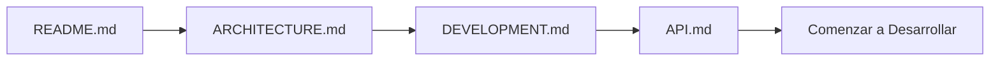
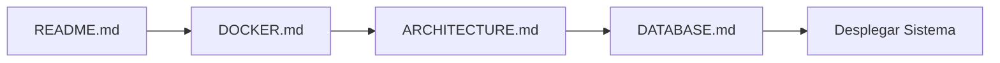
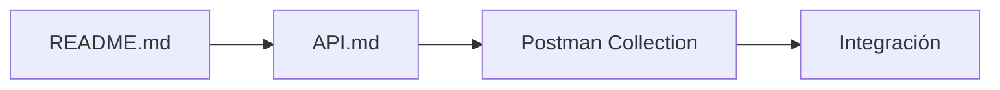
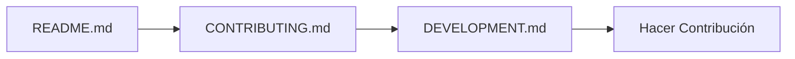

# 📚 Índice de Documentación

Bienvenido al centro de documentación del Sistema de Gestión de Arrendamientos. Aquí encontrarás toda la información necesaria para entender, desarrollar, desplegar y contribuir al proyecto.

## 🚀 Para Empezar

### 👶 Nuevos en el Proyecto
1. **[README Principal](../README.md)** - Visión general y inicio rápido
2. **[Guía de Arquitectura](ARCHITECTURE.md)** - Entender la estructura del sistema
3. **[Configuración de Desarrollo](DEVELOPMENT.md)** - Setup del entorno local

### 🏃‍♂️ Usuarios Avanzados
1. **[Documentación de APIs](API.md)** - Referencia completa de endpoints
2. **[Guía de Docker](DOCKER.md)** - Contenedores y despliegue
3. **[Esquema de Base de Datos](DATABASE.md)** - Estructura de datos

---

## 📖 Documentación por Categoría

### 🏗️ Arquitectura y Diseño

| Documento | Descripción | Audiencia |
|-----------|-------------|-----------|
| [**ARCHITECTURE.md**](ARCHITECTURE.md) | Arquitectura de microservicios, patrones de diseño, decisiones técnicas | Desarrolladores, Arquitectos |
| [**DATABASE.md**](DATABASE.md) | Esquema de BD, relaciones, índices, optimizaciones | Desarrolladores, DBAs |

### 🔧 Desarrollo

| Documento | Descripción | Audiencia |
|-----------|-------------|-----------|
| [**DEVELOPMENT.md**](DEVELOPMENT.md) | Setup local, estándares de código, testing, debugging | Desarrolladores |
| [**API.md**](API.md) | Documentación completa de APIs, ejemplos, códigos de respuesta | Desarrolladores, Integradores |

### 🚀 Despliegue y Operaciones

| Documento | Descripción | Audiencia |
|-----------|-------------|-----------|
| [**DOCKER.md**](DOCKER.md) | Contenedores, Docker Compose, troubleshooting | DevOps, Desarrolladores |

### 🤝 Colaboración

| Documento | Descripción | Audiencia |
|-----------|-------------|-----------|
| [**CONTRIBUTING.md**](../CONTRIBUTING.md) | Cómo contribuir, estándares, proceso de PR | Contribuidores |
| [**CHANGELOG.md**](../CHANGELOG.md) | Historia de cambios y releases | Todos |

---

## 🎯 Flujos de Lectura Recomendados

### 🆕 Para Nuevos Desarrolladores



**Tiempo estimado:** 2-3 horas

### 🔧 Para DevOps/Infraestructura



**Tiempo estimado:** 1-2 horas

### 📱 Para Integradores de APIs



**Tiempo estimado:** 30-60 minutos

### 🤝 Para Contribuidores



**Tiempo estimado:** 1-2 horas

---

## 📂 Estructura de Documentación

```
docs/
├── INDEX.md              # Este archivo - Índice general
├── API.md                # Documentación completa de APIs
├── ARCHITECTURE.md       # Guía de arquitectura del sistema
├── DATABASE.md           # Esquema y diseño de base de datos
├── DEVELOPMENT.md        # Guía para desarrolladores
└── DOCKER.md            # Guía de contenedores y despliegue

microservicios/
├── postman-config/       # Colección de Postman
│   ├── README_Postman.md
│   ├── *.postman_collection.json
│   └── *.postman_environment.json
└── docker-compose.yml    # Configuración de servicios

.github/
├── ISSUE_TEMPLATE/       # Templates para issues
├── pull_request_template.md
└── workflows/           # CI/CD (futuro)

# Archivos raíz
README.md                # Documentación principal
CHANGELOG.md             # Historial de cambios
CONTRIBUTING.md          # Guía de contribución
LICENSE                  # Licencia MIT
```

---

## 🔍 Índice por Temas

### 🏗️ **Arquitectura**
- **Microservicios**: [ARCHITECTURE.md#microservicios](ARCHITECTURE.md#🏗️-arquitectura-de-microservicios)
- **Patrones de Diseño**: [ARCHITECTURE.md#patrones](ARCHITECTURE.md#🔄-patrones-de-diseño)
- **Comunicación**: [ARCHITECTURE.md#comunicacion](ARCHITECTURE.md#🔗-comunicación-entre-servicios)
- **Seguridad**: [ARCHITECTURE.md#seguridad](ARCHITECTURE.md#🛡️-seguridad)

### 💾 **Base de Datos**
- **Esquema**: [DATABASE.md#esquema](DATABASE.md#📊-diagrama-entidad-relación)
- **Tablas**: [DATABASE.md#tablas](DATABASE.md#📋-descripción-de-tablas)
- **Índices**: [DATABASE.md#indices](DATABASE.md#📇-índices)
- **Optimizaciones**: [DATABASE.md#optimizaciones](DATABASE.md#📈-optimizaciones)

### 🔌 **APIs**
- **Administración**: [API.md#admin](API.md#🔐-administración-service)
- **Propietarios**: [API.md#propietarios](API.md#👤-propietarios-service)
- **Inmuebles**: [API.md#inmuebles](API.md#🏠-inmuebles-service)
- **Contratos**: [API.md#contratos](API.md#📋-contratos-service)
- **Pagos**: [API.md#pagos](API.md#💰-pagos-service)

### 🛠️ **Desarrollo**
- **Setup**: [DEVELOPMENT.md#setup](DEVELOPMENT.md#🛠️-configuración-del-entorno)
- **Testing**: [DEVELOPMENT.md#testing](DEVELOPMENT.md#🧪-testing)
- **Estándares**: [DEVELOPMENT.md#standards](DEVELOPMENT.md#📝-estándares-de-código)
- **Tools**: [DEVELOPMENT.md#tools](DEVELOPMENT.md#🔧-herramientas-de-desarrollo)

### 🐳 **Docker**
- **Configuración**: [DOCKER.md#config](DOCKER.md#🐳-configuración-docker)
- **Compose**: [DOCKER.md#compose](DOCKER.md#🔧-docker-compose)
- **Comandos**: [DOCKER.md#comandos](DOCKER.md#🚀-comandos-útiles)
- **Troubleshooting**: [DOCKER.md#troubleshooting](DOCKER.md#🔧-troubleshooting)

---

## 🆘 Obtener Ayuda

### 📝 Documentación Faltante
Si no encuentras la información que necesitas:

1. **Busca en Issues**: Puede que alguien ya haya preguntado
2. **Crea un Issue**: Usa el template "Documentation Request"
3. **Contacta al equipo**: Revisa [CONTRIBUTING.md](../CONTRIBUTING.md#comunidad)

### 🐛 Problemas con la Documentación
Si encuentras errores o información desactualizada:

1. **Crea un Issue** con el template "Bug Report"
2. **Propón cambios** con un Pull Request
3. **Sugiere mejoras** en GitHub Discussions

---

## 📊 Estado de la Documentación

| Documento | Estado | Última Actualización | Mantenedor |
|-----------|---------|---------------------|------------|
| README.md | ✅ Completo | 2024-01-15 | @equipo-dev |
| API.md | ✅ Completo | 2024-01-15 | @equipo-dev |
| ARCHITECTURE.md | ✅ Completo | 2024-01-15 | @equipo-dev |
| DATABASE.md | ✅ Completo | 2024-01-15 | @equipo-dev |
| DEVELOPMENT.md | ✅ Completo | 2024-01-15 | @equipo-dev |
| DOCKER.md | ✅ Completo | 2024-01-15 | @equipo-dev |
| CONTRIBUTING.md | ✅ Completo | 2024-01-15 | @equipo-dev |

### Leyenda
- ✅ **Completo**: Documentación actualizada y completa
- 🔄 **En Progreso**: Siendo actualizado
- ⚠️ **Desactualizado**: Necesita revisión
- ❌ **Faltante**: Por crear

---

## 🔄 Cómo Mantener la Documentación

### Para Desarrolladores
- Actualiza la documentación con cada PR significativo
- Verifica que los ejemplos de código funcionen
- Mantén las versiones de APIs sincronizadas

### Para Mantenedores
- Revisa regularmente el estado de la documentación
- Actualiza índices cuando se agreguen nuevos documentos
- Solicita feedback de la comunidad sobre claridad

---

**💡 Tip:** Marca esta página para acceder rápidamente a toda la documentación del proyecto.

**🤝 Contribuir:** ¿Falta algo? ¡Tu contribución es bienvenida! Ver [CONTRIBUTING.md](../CONTRIBUTING.md).
